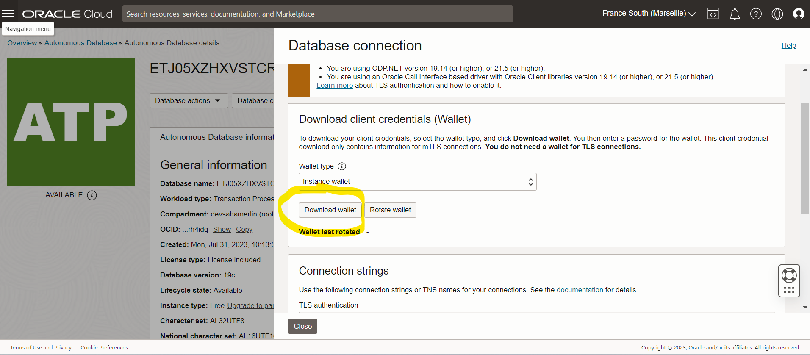

## Spring Boot Application ATP with OCI,AUTOMATED SECURE CI/CD PIPELINE FOR ORACLE CLOUD INFRASTRUCTURE WITH DEVSECOPS PRACTICES (JENKINS, OWASP, TRIVY, SONARQUBE...)

Youtube Video: https://www.youtube.com/watch?v=mvBNh6scVHk


This sample shows how to connect a Spring Boot application to OCI ATP.
after create VM, download Private and Public SSH key on the vm,

# Copy ATP Wallet on app VM
```shell
sudo oci db autonomous-database generate-wallet --autonomous-database-id <OCID of your ADB instance> --file script/userdata/wallet_oci_atp_db_cicd_app.zip --password <password>
cd script/userdata/wallet_oci_atp_db_cicd_app 
scp -r . ubuntu@84.235.237.251:/home/ubuntu/wallet_oci_atp_db_cicd_app
```


## Setup Jenkins
- get jenkins default password
```shell
sudo cat /var/lib/jenkins/secrets/initialAdminPassword
```

### Create jenkins Agent Node

 * Click on Manage Jenkins, then Node

 * Click on new Node


 * Add name and set as Permanent


 * Specify agent remote dir and scroll down


 * Add new Jenkins credentials for Jenkins-agent: Username and Private Key
 * SSH Into Master Jenkins, and get the private key generated by Terraform code


 * Add the key to Jenkins-agent credentials


 * In the Agent form, select Jenkins-agent credentials, and add jenkins agent private ip(from oracle console)

 

* Save agent form and return to nodes page


### Install Jenkins plugin:
- Eclipse Temurin Installer
- SonarQube Scanner  
- OWASP Dependency Check
- GitHub plugin
- Docker
- Docker Commons
- Docker Pipeline
- Docker API 
- Docker-build-step
- Build Pipeline
- Kubernetes Credentials
- Kubernetes Client API
- Kubernetes
- Kubernetes CLI
- Email Extension Template


### Configure JDK17, MAVEN3, sonar-scanner, DPD-Check AND docker in Global Tool Configuration


### CONFIGURE Global credentials (unrestricted): Jenkins-Agent, docker, sonar-token, github-user-credentials and gitops-user-secret-text


### Configure sonar-server in Global System


### Setup Github credentials
- Configure GitHub Webhook:
  GitHub repository > Settings > Webhooks > Add webhook `http://your-jenkins-server/github-webhook/`

- Generate new GitHub Token if not have one


- Create New credentials on Jenkins


### Setup sonarqube
- Generate sonar tokens


- Setup sonar on jenkins


- Sonar webhook: `http://<jenkins-url>:8080/sonarqube-webhook/`
  
  

### Connect ArgoCD to Private Repo `Settings/Repositories` then + CONNECT REPO and click on Connect


- Create application for that repo : SYNC POLICY `Automatic`


### Run terraform on Macbook M X, if your are using hashicorp/template
```shell
brew uninstall terraform
brew install tfenv
TFENV_ARCH=amd64 tfenv install 1.6.6
tfenv use 1.6.6
```


```shell
chmod 400 <private_key_file>
ssh -i <private_key_file> <username>@<public-ip-address> # ssh -i <private_key_file> ubuntu@<public-ip-address>
```
## ssh key
```shell
# on linux or macos
ssh-keygen -t rsa -N "" -b 2048 -C oci_iac_atp_spring_boot -f oci_iac_atp_spring_boot
# on windows: Right-click on the directory where you want to store your keys and select Git Bash Here.
ssh-keygen -t rsa -N "" -b 2048 -C oci_iac_atp_spring_boot -f oci_iac_atp_spring_boot
```

## Infrastructure
We are using terraform cloud here
Create a terraform project and terraform workspace on : https://app.terraform.io/app/devsahamerlin/workspaces


Select `CLI-driven workflow` because your need to run terraform code locally


Set variables in Terraform cloud `See list of varables to set in example.tfvars`


- TF_VAR_oci_tenancy_id
- TF_VAR_oci_user_id
- TF_VAR_oci_fingerprint
- TF_VAR_oci_private_key # pem key content, `cat oci-connection.pem | jq -c` copy content
- TF_VAR_oci_region
- GOOGLE_CREDENTIALS # json key content, use `cat file.json | jq -c` and copy content


```shell
terraform login
terraform init

#Without Terraform cloud, you can use 
terraform plan -var-file="example.tfvars"
terraform apply -var-file="example.tfvars"
```

## Estimate Terraform Cloud Cost with Standard Edition Cost on Pay-As-You-Go Billing
An example on Terraform Cloud Standard Edition that assumes 24x7 usage for a full month for 1000 Managed Resources:
- Per Hour Price: 1000 Managed Resources - 500 Free) x $0.0001359 = $0.07
- Per Month Price: (Per Hour Price x 24 x 30) = $48.92

## Download ADT Wallet: Click on Download et Define password for the wallet



## Connect to VM
Username: The default username for the instance. If you used an Oracle Linux or CentOS platform image to create the instance, the username is opc. If you used an Ubuntu platform image to create the instance, the username is ubuntu.
```shell

ssh -i <ssh-private-key-path> opc@<your-public-ip-address>
ssh -i <ssh-private-key-path> ubuntu@<your-public-ip-address> # ssh -i ../../ssh/oci_iac_atp_spring_boot ubuntu@144.24.196.158


ssh -i <privateKey> -o ProxyCommand="ssh -i <privateKey> -W %h:%p -p 22 bastionId@host.bastion.eu-marseille-1.oci.oraclecloud.com" -p 22 opc@10.1.20.191 # NOTE: The OCI Bastion Host has rotated known host keys to use the ED25519 algorithm. If you receive a man-in-the-middle error when executing the SSH command, please trust the new host key when prompted.
ssh -i -o ProxyCommand="ssh -i -W %h:%p -p 22 <bastionId>@host.bastion.<region>.oci.oraclecloud.com" -p 22 opc@10.1.20.191

ssh -i -W %h:%p -p 22 ubuntu@144.24.196.245

ssh -i \.ssh\id_rsa -o ProxyCommand="ssh -i \.ssh\id_rsa -W %h:%p -p 22 ocid1.bastionsession.oc1.eu-marseille-1.amaaaaaatsmaepqaxeoizr4i6erz7y6ux4eov3o6xdh2ykuczuxd3tutmidq@host.bastion.eu-marseille-1.oci.oraclecloud.com" -p 22 ubuntu@10.0.2.191

```
#### connect to ATP fron Bastion VM

Manually create a tunnel from SQL Developer on your computer using a bastion host

```shell
ssh -i \.ssh\id_rsa -N -L 1521:10.0.2.143:1522 -p 22 ocid1.bastionsession.oc1.eu-marseille-1.amaaaaaatsmaepqabjzlvsvnirxtiruvf5yrdtsekrg6dvg6ec4giitl2nha@host.bastion.eu-marseille-1.oci.oraclecloud.com

```
The connection string of the Autonomous Database service that you want to use to connect to the database (remember to copy the TLS string if not using mTLS)


Go to Oracle SQL Developer and add New Database Connection
Enter your connection details:
- enter the name of your connection
- enter the username, for ADB it may be admin
- enter the admin password
- optionally, check the Save Password box
- under Connection Type select Custom JDBC
- in the Custom JDBC URL box enter `jdbc:oracle:thin:@` and then paste the connection string saved earlier and replace the host name with localhost (see example below screenshot)

```shell
jdbc:oracle:thin:@(description= (retry_count=20)(retry_delay=3)(address=(protocol=tcps)(port=1522)(host=biz221dc.adb.eu-marseille-1.oraclecloud.com))(connect_data=(service_name=g0fec6cac9ce2f7_ociadb_high.adb.oraclecloud.com))(security=(ssl_server_dn_match=no)))
```


